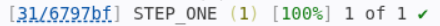

# Part 1: Learn the DSL

[← Back to Lab 03 overview](../README.md) · [Continue to Part 2 →](../PART2.md)

## Notes

You can fill in `- [ ]` with an X to check them off when rendered. This is optional.
I included a small example of how to periodically push your work for labs at the
end of `part1/01_records.nf`, if you're already familiar, you can skip past it.

## Setup

- [ ] Clone the provided classroom50 link
- [ ] As always, remember to activate your `nextflow_latest` environment —
  you'll need it for every `nextflow run` command below.
- [ ] Open all the READMEs by right-clicking and using `Show Preview` - there is
  special formatting that needs to be rendered.

## Before touching a single real tool

Build a small **toy pipeline** in this directory (`part1/`) that has the
exact same shape as the real one you'll build in Part 2. Each file has a **GIVEN**
worked example followed by a **TODO** practice task that asks you to extend
it yourself.

## Records and static typing

This lab formally introduces Nextflow's static typing and `record` types. A
record is a named bundle of fields, declared like this:

```nextflow
record Genome {
    name: String
    fna: Path
}
```

**Note the two uses of `record`:** the same keyword declares a *type*
(`record Genome { ... }`, with braces and no parentheses) and constructs an
*instance* of one (`record(name: ..., fna: ...)`, with parentheses and no
braces). You'll see both throughout this lab — a file always declares its
record types first, then constructs instances of them later.

As a general simplification, you can think of records as akin to dictionaries or
named tuples in python, though there's obvious differences between all of these
data structures. We will use records to "bundle" together important related
pieces of information. For us practically, records will typically hold some sort
of name or sample identifier, and files, either starting or generated.

A process that uses records takes a single typed parameter:

```nextflow
input:
sample: Genome
```

and accesses fields by name (`sample.name`, `sample.fna`) rather than by
position. The name `sample` assigned in this input is specific and local to this
module. It will allow you to internally reference the elements of the Genome
record using `sample.name` or `sample.fna`, which are the corresponding elements in
the named record `Genome`.

Outputs are constructed with the `record(...)` function, e.g.:

```nextflow
output:
record(
    name: String = sample.name,
    fna: Path = file('some_output.fna')
)
```

`file(...)` is what actually produces a `Path` value — wrapping a string in
`file(...)` tells Nextflow that string names a real file it should track and
stage, rather than just a plain piece of text. That's why fields meant to hold
files are typed `Path` and built with `file(...)`, the same way `String` fields
are typed `String` and built from a plain quoted value.

Records are declared right at the top of each module file, next to the process
that uses them, so you can see the exact shape of the data flowing in and out
without having to trace it through the workflow. You'll notice the same record
(e.g. `Genome`) is declared independently in more than one module. I have done 
this to be explicit in showing you the shape and contents that each process will
need. 

Every file that declares or calls a typed process needs the feature flag at the
top:

```nextflow
nextflow.enable.types = true
```

This is still a preview feature in Nextflow, so expect a warning printed at
runtime.

## part1/01_records.nf

   ```mermaid
   flowchart LR
       subgraph Sample["Sample (GIVEN)"]
           S_NAME["name: String"]
           S_FASTQ["fastq: String"]
       end
       Sample --> CONSTRUCT1["record(name: 'sample1', fastq: 'sample1.fastq.gz')"]
       subgraph AlignedSample["AlignedSample (TODO)"]
           A_NAME["name: String"]
           A_BAM["bam: String"]
       end
       AlignedSample --> CONSTRUCT2["record(name: 'sample2', bam: 'sample2.bam') (TODO)"]
       classDef new fill:#f96,stroke:#333
       class CONSTRUCT2,AlignedSample,A_NAME,A_BAM new
   ```

Nearly all our pipelines will start by constructing a channel that holds either
our starting files (and associated metadata) or information on what files to
obtain to be processed by the rest of our pipeline.

**To Do**

1. Complete the `part1/01_records.nf` as directed in the file
2. When finished, run the script: `nextflow run part1/01_records.nf`
3. Observe what gets printed to the screen and find where the output was created

**Take Note**

**Input:** The file or value needed for the process to parse, analyze or operate on.
For us, we will typically have at minimum a file and some associated metadata,
usually the name of the sample that the file originates from. In this fake example,
the input is a record with two fields. The `AlignedSample` record you just
constructed for the TODO follows the exact same pattern — a `name` plus
whatever file(s) that record needs to carry.

**Making a commit and tracking your changes (Optional if you already are familiar)**

Get into the habit of frequently committing and pushing your work to github. We
(you) have just changed the `part1/01_records.nf` file.

Whenever you are happy with a change or addition to your code (you have confirmed
it works or meets your specifications):

1. Run `git status` - this will identify files that have changed since your last
commit. You will see the `part1/01_records.nf` file here.

2. Run `git add part1/01_records.nf` to stage this file to be committed - you can
add other files that have changed as well but this can also just be a single file.

N.B. Remember to only submit code and other text-based documents. Git was not intended
to track changes in data files and generally becomes less efficient / starts to have
issues with very large files (>5 mbs). You have been provided with a `.gitignore` file
that instructs git to ignore tracking of certain files. It has been setup with common
patterns of files that should **not** be tracked and committed. Whenever you
generate new files or outputs, these may try to be tracked by git. I covered
many of the common outputs, but it's possible that I forgot to specify some file types
that may eventually show up.

If you are seeing files in your `git status` commands that you believe should not
be there (i.e. they are not code or results or documentation), you can edit your
`.gitignore` to include them. You can work off the patterns of the current
`.gitignore` for how to do this at scale.

3. Run `git commit -m "adds working code to part1/01_records.nf"` - the exact message can be
different but this will make a commit in the repository and record the exact
changes to this file. If you forget the `-m`, you will be entered into a command
line text editor (`nano`, `vim`) and will be asked to write the message in there instead.

N.B. You typically want to `add` and `commit` files in related groups. In theory,
each commit should encompass one logical change to the code. This can be seen
as well in the short imperative commit message describing the change.

4. Run `git push` to push these changes to the remote, the repository hosted on GitHub.
Please note that you can make multiple commits without using `push`. Once successfully
pushed, you should see the exact message and updates to files made in your commits
on your corresponding GitHub repository page.

### Before moving on

In `part1/01_records.nf`, make sure you have done the following:

- [ ] Make a new record of your own construction, make sure you save the file
- [ ] Run the script: `nextflow run part1/01_records.nf` and view what gets
      printed to the terminal.
- [ ] Add, commit and push your changes to Github


## part1/02_process.nf

   ```mermaid
   flowchart LR
       subgraph IN["Sample (GIVEN)"]
           IN_NAME["name: String"]
       end
       IN --> STEP1["STEP_ONE (TODO: input + output)"]
       subgraph OUT["output record from STEP_ONE (TODO)"]
           O_NAME["name: String"]
           O_LOG["log: Path (newly created file)"]
       end
       STEP1 --> OUT
       classDef new fill:#f96,stroke:#333
       class STEP1,OUT,O_NAME,O_LOG new
   ```

**To Do**

1. Complete the `part1/02_process.nf` as directed in the file
2. When finished, run the script: `nextflow run part1/02_process.nf`
3. Observe what gets printed to the screen and find where the output was created

What gets printed to the terminal is a channel containing a record. Unlike
`part1/01_records.nf`, this channel is now what gets produced by the `STEP_ONE`
process. It is a channel containing a record that holds the information generated
from the `STEP_ONE` process: the name of the sample carried by the original record
(our starting point) and the file created by `STEP_ONE` (`example.log`).

**Take Note**

**Input:** You are instructing this process that in order to run it needs as input
a record that has the same shape and keys as the `Sample` record defined in
the script. You will save it to a local variable to the process so that you can
access it by name.

**Output:** We will use records to ensure that we can identify new files produced for *each*
sample once we begin to process many samples at a time. Records are a data structure
that bundles all of this information together per sample so that we can keep track
of which files belong to which samples.

Nextflow itself does not run any actual task, you can think of it as an
orchestrator that simply handles the transfer of information or files between
processes (scripts, tools, etc.) In the output, we have to specify exactly what
is created because of several reasons:

1. Processes may create multiple files and we have to decide which to carry forward
2. Nextflow determines the success and completion of a process by checking the
exit code (a signal that the program ran to completion without error - 0 is success,
1 is an error typically) and the existence of the file specified in output.

**Workflow:** `channel.of(...)` wraps a single hardcoded value into a channel —
a quick way to run a process against one fixed record before scaling up to a
real samplesheet (which is exactly what `04_scale.nf` replaces it with). 

**work directory:** By default, nextflow stores all results in the `work/` directory
After your process has successfully run, find the directory where the `STEP_ONE`
process was executed in `work/`. It should look something like below:



Look at the leftmost part of that image, your series of numbers and letters will
look different. Look into the `work/` directory and find that directory - for me,
it would be under `work/31/6797bf.......`

Look inside the directory and note how the file created has been named with the
value from the `name` field in the input record and that the `sampleA.log` file
also holds the value substsitute in from the field.

### Before moving on

In `part1/02_process.nf`, make sure you have done the following:

- [ ] Make a new record of your own construction, make sure you save the file
- [ ] Run the script: `nextflow run part1/02_process.nf` and view what gets
      printed to the terminal.
- [ ] Explore the directory created when the process has finished running

## part1/03_chain.nf

   ```mermaid
   flowchart LR
       subgraph IN["Sample"]
           IN_NAME["name: String"]
       end
       IN --> STEP1[STEP_ONE]
       subgraph OUT1["output record from STEP_ONE"]
           O1_NAME["name: String"]
           O1_LOG["log: Path"]
       end
       STEP1 --> OUT1
       OUT1 --> STEP2["STEP_TWO (TODO)"]
       subgraph OUT2["output record from STEP_TWO"]
           O2_NAME["name: String"]
           O2_LOG["log: Path"]
       end
       STEP2 --> OUT2
       classDef new fill:#f96,stroke:#333
       class STEP2,OUT2,O2_NAME,O2_LOG new
   ```

**To Do**

1. Complete the `part1/03_chain.nf` as directed in the file
2. When finished, run the script: `nextflow run part1/03_chain.nf`
3. Observe what gets printed to the screen and find where the output was created

**Take Note**

**Output:** We will often name the files produced by each process so that we can
identify which biological sample they were generated from. This is the reason
the records you've seen and created will often carry through some value or ID.

We will use string interpolation `${sample.name}` to substitute in that value
from the record. Most programs will have some rules or guidelines about the naming
conventions of files produced. We will often take advantage of this to directly
name the files produced by processes with these values we have carried through
in our records (e.g. `${sample.name}.step2.log`).

**Workflow:** By convention, you will save the output of every process using the `=`
operator to a variable that you name. You can call the processes by their name
specified after process.

### Before moving on

In `part1/03_chain.nf`, ensure that you have done the following:

- [ ] Construct the new process `STEP_TWO` by filling in the blanks
- [ ] In the `workflow` block, connect the processes by passing the outputs of
      `STEP_ONE` to `STEP_TWO` and observe the outputs
- [ ] Find where each output was created and look at the contents of each directory

## part1/04_scale.nf

   ```mermaid
   flowchart LR
       CSV[/toy_samplesheet.csv/] -->|"fromPath → splitCsv → map (TODO)"| S1
       CSV -->|"fromPath → splitCsv → map (TODO)"| S2

       subgraph ROW_A["row 1: same steps, own copy of the data"]
           direction LR
           S1["Sample<br/>name: 'sampleA'<br/>condition: 'control'"] --> STEP1A[STEP_ONE] --> OUT1A["output record from STEP_ONE<br/>name: 'sampleA'<br/>condition: 'control'<br/>log: 'sampleA.log'"] --> STEP2A[STEP_TWO] --> OUT2A["output record from STEP_TWO<br/>name: 'sampleA'<br/>condition: 'control'<br/>log: 'sampleA.step2.log'"]
       end

       subgraph ROW_B["row 2: same steps, own copy of the data"]
           direction LR
           S2["Sample<br/>name: 'sampleB'<br/>condition: 'treatment'"] --> STEP1B[STEP_ONE] --> OUT1B["output record from STEP_ONE<br/>name: 'sampleB'<br/>condition: 'treatment'<br/>log: 'sampleB.log'"] --> STEP2B[STEP_TWO] --> OUT2B["output record from STEP_TWO<br/>name: 'sampleB'<br/>condition: 'treatment'<br/>log: 'sampleB.step2.log'"]
       end

       classDef new fill:#f96,stroke:#333
       class CSV,S1,S2 new
   ```

**To Do**

1. Complete the `part1/04_scale.nf` as directed in the file
2. When finished, run the script: `nextflow run part1/04_scale.nf`
3. Observe what gets printed to the screen and find where the output was created

**Take Note**

**Workflow:** You may notice that if you view the expression without the .map()
creating a channel from the `params.part1_samplesheet` and `view()` it, it will
resemble the record that's eventually produced with `map`. `.splitCsv()` by
default will create a linked hashmap, which is similar to, but not a `record`
type, which is what our pipelines require. Passing `header: true` tells
`splitCsv()` to treat the first row of the CSV (`name,condition`) as field
names instead of data, so every other row becomes a hashmap keyed by those
column names (e.g. `[name: 'sampleA', condition: 'control']`).

This `csv_ch` (one record per row, keyed by `name`) is exactly the channel
you'll reuse unchanged in `05_parallel.nf` and `06_join.nf` — the next two
files send it down two separate branches and then rejoin the results by that
same `name` field.

### Before moving on

- [ ] Use a combination of `channel.fromPath`, `splitCsv`, and `map` to convert
      each row of the `params.part1_samplesheet` to a channel containing records with
      the same information.
- [ ] View the contents of the channel generated above as well as the output
      channel of `STEP_TWO`
- [ ] Find where each output was created and look at the contents of each directory


## part1/05_parallel.nf

   ```mermaid
   flowchart LR
       CSV[/toy_samplesheet.csv/] -->|"fromPath → splitCsv → map"| S1
       CSV -->|"fromPath → splitCsv → map"| S2

       subgraph ROW_A["row 1: same two branches, own copy of the data"]
           direction LR
           S1["Sample<br/>name: 'sampleA'<br/>condition: 'control'"] --> STEP1A_A[STEP_ONE_A]
           S1 --> STEP1B_A["STEP_ONE_B (TODO)"]
           STEP1A_A --> OUT1A_A["output record from STEP_ONE_A<br/>name: 'sampleA'<br/>condition: 'control'<br/>a_result: 'sampleA.step1a.log'"]
           STEP1B_A --> OUT1B_A["output record from STEP_ONE_B (TODO)<br/>name: 'sampleA'<br/>condition: 'control'<br/>b_result: 'sampleA.step1b.log'"]
       end

       subgraph ROW_B["row 2: same two branches, own copy of the data"]
           direction LR
           S2["Sample<br/>name: 'sampleB'<br/>condition: 'treatment'"] --> STEP1A_B[STEP_ONE_A]
           S2 --> STEP1B_B["STEP_ONE_B (TODO)"]
           STEP1A_B --> OUT1A_B["output record from STEP_ONE_A<br/>name: 'sampleB'<br/>condition: 'treatment'<br/>a_result: 'sampleB.step1a.log'"]
           STEP1B_B --> OUT1B_B["output record from STEP_ONE_B (TODO)<br/>name: 'sampleB'<br/>condition: 'treatment'<br/>b_result: 'sampleB.step1b.log'"]
       end

       classDef new fill:#f96,stroke:#333
       class STEP1B_A,STEP1B_B,OUT1B_A,OUT1B_B new
   ```

**To Do**

1. Complete the `part1/05_parallel.nf` as directed in the file
2. When finished, run the script: `nextflow run part1/05_parallel.nf`
3. Observe what gets printed to the screen and find where the output was created


**Take Note**

**Workflow:** You can see that both `STEP_ONE_A` and `STEP_ONE_B` only require the
information in the `sample_ch` — neither one depends on the other's output.
That lack of a shared dependency is exactly what lets Nextflow schedule them
concurrently, unlike `03_chain.nf`, where `STEP_TWO` couldn't start until
`STEP_ONE` had finished.


### Before moving on

- [ ] Create a `STEP_ONE_B` process similar to the `STEP_ONE_A` process
- [ ] In the `workflow`, call the `STEP_ONE_B` process on the initial starting
      channel


## part1/06_join.nf

   ```mermaid
   flowchart LR
       subgraph ROW_A["sampleA: join by name"]
           direction LR
           A_A["from STEP_ONE_A<br/>name: 'sampleA'<br/>condition: 'control'<br/>a_result: 'sampleA.step1a.log'"] --> J_A(["joined<br/>name: 'sampleA'<br/>condition: 'control'<br/>a_result: 'sampleA.step1a.log'<br/>b_result: 'sampleA.step1b.txt'"])
           B_A["from STEP_ONE_B<br/>name: 'sampleA'<br/>condition: 'control'<br/>b_result: 'sampleA.step1b.txt'"] --> J_A
       end

       subgraph ROW_B["sampleB: join by name"]
           direction LR
           A_B["from STEP_ONE_A<br/>name: 'sampleB'<br/>condition: 'treatment'<br/>a_result: 'sampleB.step1a.log'"] --> J_B(["joined<br/>name: 'sampleB'<br/>condition: 'treatment'<br/>a_result: 'sampleB.step1a.log'<br/>b_result: 'sampleB.step1b.txt'"])
           B_B["from STEP_ONE_B<br/>name: 'sampleB'<br/>condition: 'treatment'<br/>b_result: 'sampleB.step1b.txt'"] --> J_B
       end

       classDef new fill:#f96,stroke:#333
       class J_A,J_B new
   ```

**To Do**
1. Complete the `part1/06_join.nf` as directed in the file
2. When finished, run the script: `nextflow run part1/06_join.nf`
3. Observe what gets printed to the screen and find where the output was created


**Take Note**

**Workflow:** `join` is one operator that will help you transform and manipulate
channels. Here, we needed to use `join` because our `FINAL` process required the
outputs from both `STEP_ONE_A` and `STEP_ONE_B`. One other advantage of carrying
a field in the record corresponding to the `name` of a sample is that we can use
it as a key to ensure that we join together the outputs from separate processes
for the same samples. Since each sample produces exactly one `STEP_ONE_A` record
and one `STEP_ONE_B` record with the same `name`, the join is 1:1 — you should
end up with the same number of joined records as samples in the samplesheet.

### Before moving on

- [ ] Use the join operator to merge the contents of the two output channels
      together for the final process that needs them

- [ ] Ensure you understand how many records will be generated by your join

---

[← Back to Lab 03 overview](../README.md) · [Continue to Part 2 →](../PART2.md)
