# Part 2: Build & Operate the Pipeline

[← Back to Lab 03 overview](README.md) · [← Back to Part 1](../part1/README.md)

If you haven't done [Part 1: Learn the DSL](part1/README.md) yet, do that
first — it covers the `record`/channel syntax this part assumes you already
know.

## Objective

Today we are going to get more experience putting together a bioinformatics
pipeline in nextflow. This pipeline will download multiple bacterial genomic
sequences, annotate them using Prokka and choose a single gene's coordinates
from the GFF created, make a FASTA index of the genome, and extract out the
genomic sequence of the chosen gene.

Practically, you will read a specification document of the pipeline and then
connect all the processes together in the `main.nf`. This lab will expose you to
a number of concepts and aspects of nextflow that you will be using throughout
the semester.

Rather than building the whole five-process pipeline in one go, **Build the
pipeline** below walks you through it in cumulative stages, showing you what's
new in each addition. **Operate your pipeline** then covers operating and 
debugging the finished pipeline (stub vs. real runs, resource labels, `nextflow log`,
linting, publishing results).

This is the same pipeline from `specifications.md`, which you were exposed to 
before.

## Setup

- [ ] Notice the structure of our `main.nf`. Processes aren't defined in
  `main.nf` itself — they're in their own directories under `modules/`, and
  `main.nf` uses `include` to import each one and use it in the workflow.

## Build the pipeline

Instead of writing `main.nf` all at once, you'll build the pipeline up as
five stages. **Each stage's file is the previous stage's file plus exactly
one new thing**

For example, `part2/01_request.nf` builds and views the starting channel on its
own; `part2/02_download.nf` then adds the one process call on top of it.

Every stage is small enough to validate in seconds with a stub run before you
move on:

### Stub runs (-stub)

Nextflow offers a `-stub` flag. Instead of running a process's real
`script:`/`shell:` block, it runs that process's `stub:` block instead — for
every process here, the stub just `touch`es placeholder files with the right
names. This lets you check that your *wiring* (channels, records, which
process feeds which) is correct in seconds, without waiting on real
downloads/annotation/indexing or needing any tool actually installed. Every
module below already has a working `stub:` block given to you.

You'll use `nextflow run <file> -stub` after most stages unless specified
otherwise.

### part2/01_request.nf

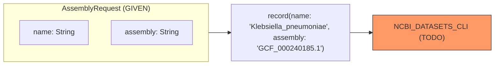

**To Do**

1. Run `nextflow run part2/01_request.nf`
2. View what gets printed to the terminal

### part2/02_download.nf

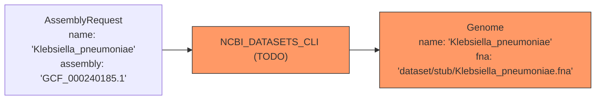

**What's Changed**

All that's changed from last time is we have now passed the initial channel
we generated to the actual NCBI_DATASETS_CLI process.

**To Do**

1. In `modules/ncbi_datasets_cli/main.nf` — declare the `AssemblyRequest` (input) and
  `Genome` (output) `record` types at the top of the file. I have defined for you
  what should be contained within each.

2. Run the following:

```bash
nextflow run part2/02_download.nf -stub
```

`02_download.nf` should run one `NCBI_DATASETS_CLI` process and print a
`Genome` record (`name`, `fna`).

### part2/03_prokka.nf

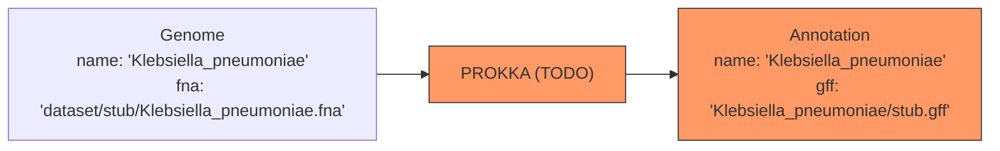

**What's Changed**

We have now taken the output of NCBI_DATASETS_CLI and we want to run another task
using what was downloaded.

**To Do**

1. In `modules/prokka/main.nf`, make the `output` record containing the name from
the original record and the file created by PROKKA (given in the code)

2. Run the command: `nextflow run part2/03_prokka.nf -stub`

`03_prokka.nf` should run `NCBI_DATASETS_CLI` → `PROKKA` and print an
`Annotation` record (`name`, `gff`).

### part2/04_chain.nf

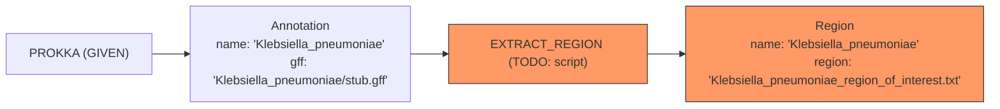

**What's Changed**

We are adding a new process that now takes the output we just generated from PROKKA.

**To Do**

1. In `part2/04_chain.nf`, fill in the inputs and outputs in the script line
by looking at the `input` and `output` blocks given.

2. Run the command: `nextflow run part2/04_chain.nf -stub` and observe what
gets printed to your terminal.

`04_chain.nf` should run `NCBI_DATASETS_CLI` → `PROKKA` → `EXTRACT_REGION` and
print a `Region` record (`name`, `region`).

### part2/05_scale_request.nf

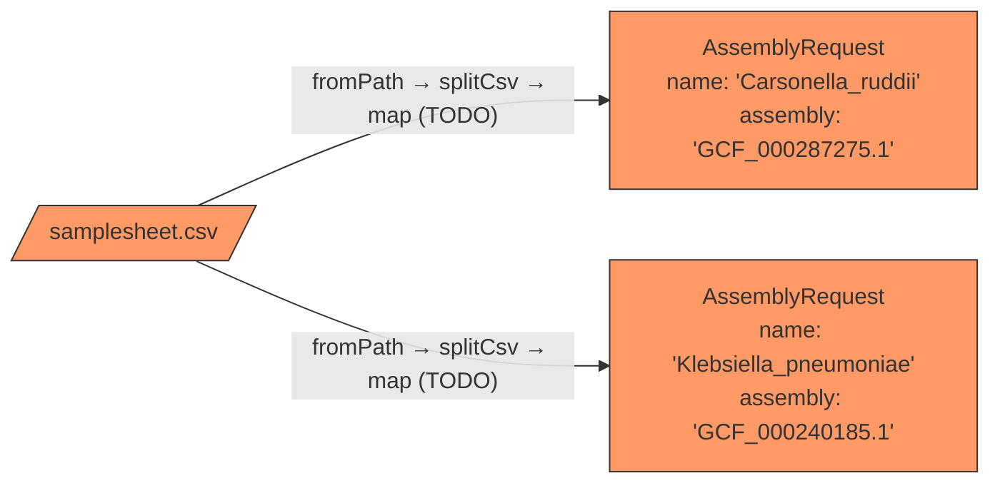

**What's Changed**

Instead of hard-coding values in our scripts, we often want to encode this
information in a structured file (CSV) that will allow us to pass multiple
samples to our pipeline. This also makes it convenient if we ever need to add
or remove samples.

**To Do**

1. Use `map`, `channel.fromPath`, and `splitCsv()` to view a channel that holds
the information from the samplesheet provided.

2. Run the command: `nextflow run part2/05_scale_request.nf`

`part2/05_scale_request.nf` should run and print out two lines to your terminal
containing the fields from the CSV as a nextflow record.

### part2/06_scale.nf

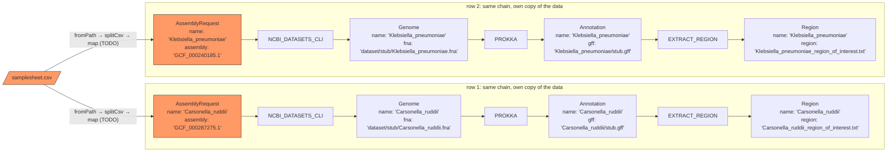

**What's Changed**

`NCBI_DATASETS_CLI` → `PROKKA` → `EXTRACT_REGION` is exactly the series of processes
from before. The only new piece is `request_ch` which you already generated.
Now because `request_ch` holds two elements (the two rows of data in our CSV),
this series of processes will happen in parallel for each.

**To Do**

1. Copy your working code from `part2/05_scale_request.nf` to the beginning of
your workflow in `part2/06_scale.nf`.

2. Run the command: `nextflow run part2/06_scale.nf -stub`

### part2/07_faidx.nf

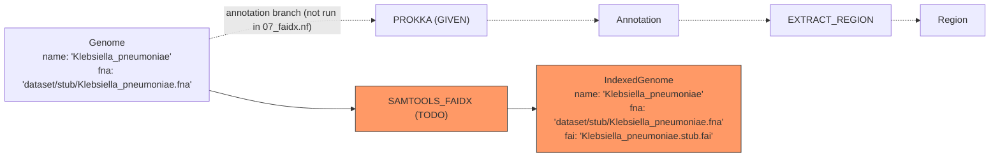

**What's Changed**

We are adding a process that also uses the `genome_ch` we generated earlier. This
process can run in parallel directly after the `NCBI_DATASETS_CLI` process finishes
because it only requires the outputs from that process.

**To Do**

1. Fill in and complete the `input` and `output` in `part2/07_faidx.nf`

2. Run the command: `nextflow run part2/07_faidx.nf -stub` and observe what gets printed
to your terminal.

### part2/08_branch.nf

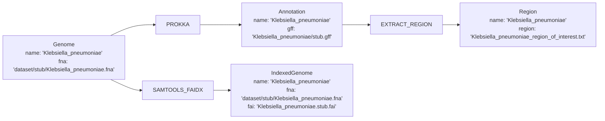

**What's Changed**

Nothing new to write — this file just runs both branches together so you can
observe their outputs independently.

**To Do**

1. Run the command: `nextflow run part2/08_branch.nf -stub` and observe
that both branches print, independently, for each sample.

### part2/09_join.nf

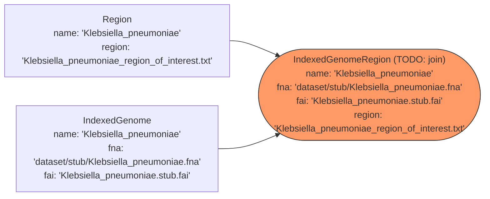

**What's Changed**

This pipeline is nearly complete but we now need to generate a record that per
sample combines the output from the `EXTRACT_REGION` process and the `SAMTOOLS_FAIDX`
process.

**To Do**

1. In `part2/09_join.nf`, use the join operator to create a channel with records
that have all the fields needed for the final process, `SAMTOOLS_FAIDX_SUBSET`.

2. Run the command: `nextflow run part2/09_join.nf -stub` and observe what gets printed.

`part2/09_join.nf` should print an `IndexedGenomeRegion` record (`name`, `fna`,
`fai`, `region`) for each sample.


### main.nf

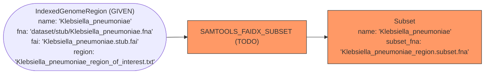

**What's Changed**

We have now built the entire pipeline and have joined two records from separate
processes together so that we may perform the final step, which requires the
output from both `EXTRACT_REGION` and `SAMTOOLS_FAIDX`.

**To Do**

1. In `main.nf`, copy and paste your working code that joins the outputs together
from `part2/09_join.nf`.

2. In the `workflow`, call the final process on the joined channel.

3. Run the command: `nextflow run main.nf -stub`

`main.nf` should run the full pipeline end-to-end for both samples, producing a
`Subset` record (`name`, `subset_fna`) for each — this is the "Stub-run
milestone" from `specifications.md`.

### The entire pipeline

Now that every piece is written, here's the whole pipeline again, but
exploded out per sample — each row of `samplesheet.csv` gets its own,
independent copy of every record and process, from the initial request all
the way to the final `Subset`.

```mermaid
flowchart LR
    CSV[/samplesheet.csv/] --> ROW1_REQ
    CSV --> ROW2_REQ

    subgraph ROW_1["row 1: Carsonella_ruddii"]
        direction LR
        ROW1_REQ["AssemblyRequest<br/>name: 'Carsonella_ruddii'<br/>assembly: 'GCF_000287275.1'"] --> ROW1_NCBI[NCBI_DATASETS_CLI]
        ROW1_NCBI --> ROW1_GENOME["Genome<br/>name: 'Carsonella_ruddii'<br/>fna: 'dataset/stub/Carsonella_ruddii.fna'"]
        ROW1_GENOME --> ROW1_PROKKA[PROKKA] --> ROW1_ANNOT["Annotation<br/>name: 'Carsonella_ruddii'<br/>gff: 'Carsonella_ruddii/stub.gff'"] --> ROW1_EXTRACT[EXTRACT_REGION] --> ROW1_REGION["Region<br/>name: 'Carsonella_ruddii'<br/>region: 'Carsonella_ruddii_region_of_interest.txt'"]
        ROW1_GENOME --> ROW1_FAIDX[SAMTOOLS_FAIDX] --> ROW1_IDX["IndexedGenome<br/>name: 'Carsonella_ruddii'<br/>fna: 'dataset/stub/Carsonella_ruddii.fna'<br/>fai: 'Carsonella_ruddii.stub.fai'"]
        ROW1_REGION --> ROW1_MERGED
        ROW1_IDX --> ROW1_MERGED
        ROW1_MERGED(["IndexedGenomeRegion<br/>name: 'Carsonella_ruddii'<br/>fna: 'dataset/stub/Carsonella_ruddii.fna'<br/>fai: 'Carsonella_ruddii.stub.fai'<br/>region: 'Carsonella_ruddii_region_of_interest.txt'"]) --> ROW1_SUBSET[SAMTOOLS_FAIDX_SUBSET]
        ROW1_SUBSET --> ROW1_RESULT["Subset<br/>name: 'Carsonella_ruddii'<br/>subset_fna: 'Carsonella_ruddii_region.subset.fna'"]
    end

    subgraph ROW_2["row 2: Klebsiella_pneumoniae"]
        direction LR
        ROW2_REQ["AssemblyRequest<br/>name: 'Klebsiella_pneumoniae'<br/>assembly: 'GCF_000240185.1'"] --> ROW2_NCBI[NCBI_DATASETS_CLI]
        ROW2_NCBI --> ROW2_GENOME["Genome<br/>name: 'Klebsiella_pneumoniae'<br/>fna: 'dataset/stub/Klebsiella_pneumoniae.fna'"]
        ROW2_GENOME --> ROW2_PROKKA[PROKKA] --> ROW2_ANNOT["Annotation<br/>name: 'Klebsiella_pneumoniae'<br/>gff: 'Klebsiella_pneumoniae/stub.gff'"] --> ROW2_EXTRACT[EXTRACT_REGION] --> ROW2_REGION["Region<br/>name: 'Klebsiella_pneumoniae'<br/>region: 'Klebsiella_pneumoniae_region_of_interest.txt'"]
        ROW2_GENOME --> ROW2_FAIDX[SAMTOOLS_FAIDX] --> ROW2_IDX["IndexedGenome<br/>name: 'Klebsiella_pneumoniae'<br/>fna: 'dataset/stub/Klebsiella_pneumoniae.fna'<br/>fai: 'Klebsiella_pneumoniae.stub.fai'"]
        ROW2_REGION --> ROW2_MERGED
        ROW2_IDX --> ROW2_MERGED
        ROW2_MERGED(["IndexedGenomeRegion<br/>name: 'Klebsiella_pneumoniae'<br/>fna: 'dataset/stub/Klebsiella_pneumoniae.fna'<br/>fai: 'Klebsiella_pneumoniae.stub.fai'<br/>region: 'Klebsiella_pneumoniae_region_of_interest.txt'"]) --> ROW2_SUBSET[SAMTOOLS_FAIDX_SUBSET]
        ROW2_SUBSET --> ROW2_RESULT["Subset<br/>name: 'Klebsiella_pneumoniae'<br/>subset_fna: 'Klebsiella_pneumoniae_region.subset.fna'"]
    end
```

## Operate your pipeline

Your pipeline is built — the rest of this document is about *running* it for
real and using Nextflow's tooling to configure, debug, and inspect it.

## Running your pipeline for real

[Advanced SCC Usage](https://bu-bioinfo.github.io/bf528/lectures/week-03/)

Once you've confirmed that your pipeline works with a stub run, you should see
all of your processes finish. Check to make sure that the appropriate number of
processes run based on how many samples are in your `samplesheet.csv`.

Once you have, run the following command to run your pipeline for real:

```bash
nextflow run main.nf -profile conda,cluster
```

Feel free to run `qstat -u <your-username>` during this time. You can see all
your different jobs run on compute nodes as the workflow progresses.

You can also use `qstat -j <job-id-from-qstat>` to see more details about your
job.

When the pipeline has finished, use `nextflow log` and find the `RUN NAME` of
the most recent pipeline run. Once you've found the most recent run, use the
following command:

```bash
nextflow log <run_name> -filter 'process == "PROKKA"'
```

This will show you the directory where the PROKKA processes ran. Navigate to one
and make note of the `.command.sh` and observe the command that was actually
executed.

- [ ] Find the directory where one PROKKA process ran and observe the command.
  Keep this comparison in mind for the results of the next section.

## Process configuration: ext.args and withName

So far, every command in our `script:` blocks has been fully hard-coded. In
practice you'll often want to tweak a tool's flags per-run or per-process
without editing the module itself — that's what `ext.args` is for.

Inside a process, `task.ext.args` reads a value set from `nextflow.config`. It
isn't set by default, so always guard it with the Elvis operator (`?:`) so the
process still works if nobody configures it:

```nextflow
script:
def args = task.ext.args ?: ''
"""
sometool ${args} $input
"""
```

`?:` is Groovy's **Elvis operator** — shorthand for `x ? x : y`: "use `x` if
it's truthy, otherwise fall back to `y`." So `task.ext.args ?: ''` reads as "use
whatever `ext.args` was configured to, or an empty string if it was never set."
You'll see this pattern constantly anywhere Nextflow code reads an optional
config value, since almost none of them are set by default.

You set that value using a `withName:` selector in `nextflow.config`, which
targets one specific process by name — as opposed to `withLabel:`, which you
already used to target every process sharing a label:

```nextflow
process {
    withName: 'PROKKA' {
        ext.args = '--kingdom Bacteria'
    }
}
```

You should see the above in the `nextflow.config` on lines 16-20. Please
uncomment (erase the */ and /* on lines 15 and 21), save the file and try
re-running your pipeline with the following command:

```bash
nextflow run main.nf -profile conda,cluster -with-report
```

- [ ] Uncomment the lines in your `nextflow.config`
- [ ] Observe what happens: which jobs re-run and which remain `cached`?

### Resume

If you look at the last line of the `nextflow.config`, you can see an option
specified `resume = true`. When nextflow runs, it caches information about jobs
that have successfully finished. With this option, if your pipeline failed at a
later step, nextflow will not re-run steps that have already finished.

There are times when you want your pipeline to start from the beginning, in
which case, you will want to change this value to `resume = false` or you can
delete the directories in `work/` to force nextflow to re-run everything. You
can avoid deleting the `conda/` directory in `work/` so nextflow doesn't have to
remake the environments.

**Back to your pipeline** You should see `PROKKA` re-run, along with everything
downstream of it including `EXTRACT_REGION` and `SAMTOOLS_FAIDX_SUBSET` while
`SAMTOOLS_FAIDX` stays `cached`. Nextflow computes a hash for each individual
task from everything that could affect its output: the task's inputs, its
script, and the process directives applied to it (including `ext.args`).
Changing `ext.args` on `PROKKA` changes only `PROKKA`'s own hash but it also
changes `PROKKA`'s output files, and those files are the *input* to
`EXTRACT_REGION`, so `EXTRACT_REGION`'s hash changes too, and its output
cascades the same way into `SAMTOOLS_FAIDX_SUBSET`. `SAMTOOLS_FAIDX` never
touches `PROKKA`'s output (it depends only on the downloaded genome from
`NCBI_DATASETS_CLI`), so its inputs are unchanged and it's the one process that
stays cached. This reuse only happens because `resume = true` is set in
`nextflow.config` — more on that later.

Wait until this new re-run finishes and take a look at the HTML report that was
generated in your directory.

- [ ] Take a look at the HTML report that was generated when the re-run of your
  pipeline finished

- [ ] Find where the new PROKKA processes ran for this re-run. Find one of their
  work directories and note the `.command.sh`. Compare what is added to the
  command compared to earlier.

## Debugging with nextflow log and the work directory

Every process execution happens in its own isolated directory under `work/`, and
Nextflow keeps a record of every run you've done. These two tools are how you
find out what actually happened when something fails — or, like above, how you
confirm a config change actually took effect.

`nextflow log` on its own lists every run you've executed in this directory, by
its randomly-generated run name (e.g. `tiny_leavitt`). To see which fields are
available, use `-list-fields`. To print specific fields for a run's tasks:

```bash
nextflow log <run_name> -f process,status,exit,duration,workdir
```

Navigate to the appropriate sub-directory underneath `work/`. You can use the
one given by the command above or just choose any random subdirectory.

Every task's work directory contains at minimum the following (N.B. each task
directory will also include that processes' inputs and outputs):

- `.command.sh` — the exact script Nextflow generated and ran (or would have
  run, for a stub run). This is where you go to confirm `ext.args` was actually
  substituted into the command. You can also see the appropriate variable
  substitutions that were made.
- `.command.run` — the wrapper script Nextflow actually submits to the executor.
  It sets up the environment (e.g. activating the conda env) and invokes
  `.command.sh` inside it, wrapped with the bookkeeping Nextflow needs to detect
  completion.
- `.command.out` — stdout from the task.
- `.command.err` — stderr from the task; usually the first place to look when a
  task fails.
- `.command.log` — the merged stdout+stderr stream Nextflow polls to know when
  the task has finished.
- `.command.begin` — an empty marker file written the instant the task starts
  running (used to compute start time / wait time).
- `.exitcode` — the exit status of the task's command. 1 means an error
  occurred, and 0 means a successful exit.

If you've submitted jobs to the SCC directly with `qsub` before, `.command.out`
and `.command.err` are Nextflow's equivalent of the `.o<jobid>`/`.e<jobid>`
files a bare SGE job writes.

- [ ] Navigate to the appropriate sub-directory underneath `work/` and inspect
  the contents of the `.command.sh` file to confirm that `ext.args` was actually
  substituted into the command.
- [ ] Check the `.exitcode` file to confirm that the task exited successfully
  (exit code 0).
- [ ] Observe how the `qsub` script arguments are found in the `.command.run`
  file

## Labels

At the same level as the `conda` declarations in the `PROKKA` process, add a
line that specifies a label like so:

```nextflow
label 'process_medium'
```

Now go the `nextflow.config` and add a label (with the same formatting) between
`withLabel: process_single` and `withLabel: process_high`:

```nextflow
withLabel: process_medium {
    cpus = 4

}
```

Now when you run with `-profile cluster,conda`, the `PROKKA` process will use
the `process_medium` label, which will request 4 CPUs. **However**, this label
only *requests* the amount of resources from the SCC. You will also need to
ensure that your process can make use of the resources by adding the appropriate
flags to the `prokka` command in the `PROKKA` process. Not every tool can make
use of multiple CPUs, so you'll need to check the documentation for the tool to
see if it supports parallel processing. Prokka supports parallel processing via
the `--cpus` flag. Inside the actual command, you can use the variable
`$task.cpus` to access the value defined in the config.

Navigate to the `PROKKA` process module and replace the hard coded `1` argument
after `--cpus` with `$task.cpus`. Once done, re-run your workflow again with the
following command:

```nextflow
nextflow run main.nf -profile conda,cluster -with-report
```

- [ ] While the job is queued or running, run `qstat -j <native_id>` and check
  what was actually requested
- [ ] Once the job has finished, run `qacct -j <native_id>` (`qstat` won't show
  it anymore) — this is the important one: it reports *actual* usage (`maxvmem`,
  `cpu`, `ru_wallclock`, exit status). `qacct` accounting data can take a few
  seconds to appear after a job finishes, it may not be there instantly.
- [ ] Check the `.command.sh` for one of the new PROKKA processes, and ensure
  you see the value from `process_medium` in the script command.
- [ ] You should be able to see that your pipeline finishes faster than the
  previous run

## Linting, formatting, and inspecting pipelines

A few commands help you sanity-check a pipeline without actually running it:

- `nextflow lint <path>` — parses your scripts and config with the strict parser
  and reports errors, without executing anything:

  ```bash
  nextflow lint .
  ```

- `nextflow lint -format <path>` — the same linter, but also rewrites your files
  to a consistent style (this is the current replacement for what used to be a
  separate `nextflow fmt` command). Useful to run before committing:

  ```bash
  nextflow lint -format modules/prokka/main.nf
  ```

Now in your directory, please run the following command:

```nextflow
nextflow lint .
```

On your terminal, you will probably see 3 warnings and 22 files with no errors
(this now includes every `part1/*.nf` and `part2/*.nf` file, all of which
should also be clean by this point). The 3 warnings are about an
unused variable (the final output) and two deprecated uses of the `shell`
block. Go to the files where it warned about the `shell` block usage and
replace them with `script`.

You can also use a built-in formatted to reformat any nextflow file according to
standard conventions.

**Optional** Choose any working nextflow module and run the following command:

```nextflow
nextflow lint -format modules/<name-of-module>/main.nf
```

## Results - moving important files outside of the work directory

By now, you've likely noticed that it's somewhat cumbersome to navigate through
the `work` directory. Nextflow has a built-in convention for `publishing`
certain outputs to a more convenient location, `results`, by default.

If you look under the `publish:` block in the `main.nf`, you'll notice that we
have saved the output of PROKKA to a new variable called `prokka_results`. Below
the `workflow` block, you can see we have one more block: `output` and this is
where `prokka_results` is listed.

Both of these lines together will instruct Nextflow to save the outputs (just
the outputs declared in the process, not the accessory files) of the declared
variables to the `results/` directory. This will enable you to more easily find
or inspect important outputs from your processes. Please note that for every
variable declared under `publish:`, you must have declare it also in the
`output` block or nextflow will throw an error.

## Small aside - FASTA format

FASTA is a simple text format for representing nucleotide or protein sequences.
Each record starts with a header line beginning with `>` containing an
identifier and optional description, followed by one or more lines of sequence
characters. For example:

```
>NC_016845.1 Klebsiella pneumoniae subsp. pneumoniae chromosome
ATGGCTAGCTAGCTAGCTAGCTAGCTAGCTAGCTAGCTAGCTAGC...
```

We'll only need to know this much for today's lab — we'll cover the FASTA format
(and related formats like FASTQ) in much more detail later in the course.

## Small aside - FASTA Indexes

Though the genomes we are working with today are relatively small, it can still
be cumbersome to work with such large sequences. For example, let's say we know
that a specific region of the genome should correspond to a specific gene and we
want to extract out just that sequence of gene. The most straightforward (and
naive) method would be to read through the entire genome until we find that
sequence.

While this may finish quickly for smaller genomes, we can take advantage of the
regular structure of files and create an index that allows us to more quickly
retrieve sequences from a FASTA file by its coordinates. This index contains
information about the length of the overall sequence, the position in the file
where the sequence begins and the number of characters and bytes per line. This
information together can allow us to extract a subsequence from the original by
specifying it's coordinates or range. Importantly, this index prevents us from
having to read the file beginning to end. You can think of this as being akin to
a table of contents in a book.

This idea can also be extended to the problem of aligning short sequences to a
reference sequence. We will need to build a special index (data structure) that
allows us to more efficiently find the best alignment of a short read in a much
longer sequence. Every alignment algorithm will require you to first build an
index that will enable the algorithm to efficiently and more quickly align
reads. These indexes are unique to each tool and algorithm and are typically
created using a different command provided by the software.

Returning to FASTA indexes, by convention, these indexes are a new file with the
.fai extension added directly to the end of the original name. Tools that
utilize these indexes expect that the original FASTA and the .fai index are in
the same location.

To extract out a random sequence by its location, you will need the original
FASTA, the index file, and the region you want the sequence of in the format of
`chr_name:start_pos-end_pos` or `NC_016845.1:18065-20962`. We will extract out
this region by looking at the GFF file of the genomes.


## Key Concepts and Tools

**Modularization**
- You can see that we no longer have processes in `main.nf`. Instead, they are
  defined in their own directories under modules/. Each process gets a separate
  .nf file that defines its inputs, outputs, and command.

**Tools this pipeline runs**
- `ncbi-datasets-cli` genome downloads — see "ncbi_datasets_cli"
- Prokka genome annotation, GFF files — see "prokka"
- `samtools faidx`, FASTA index (`.fai`), region coordinates (`chr:start-end`) —
  see "Small aside - FASTA Indexes", "samtools_faidx", and
  "samtools_faidx_subset"

**Running and configuring the pipeline**
- `stub` block, `-stub` flag — see "Stub runs (-stub)" and "Build the
  pipeline"
- `ext.args`, `task.ext.args ?: ''`, `withName:` process selector — see "Process
  configuration: ext.args and withName"

**Debugging**
- `nextflow log`, `-f` fields, `-filter` expressions — see "Debugging with
  nextflow log and the work directory"
- `.command.sh`, `.command.err`, `.exitcode` in the work directory — see
  "Debugging with nextflow log and the work directory"

**Once your pipeline works** — quality-of-life features, not required for a
working pipeline
- `-with-report` — see "Process configuration: ext.args and withName"
- `resume` in `nextflow.config` — see "Resume"
- Process `label`s and resource requests in `nextflow.config` — see "Labels"
- `nextflow lint` — see "Linting, formatting, and inspecting pipelines"
- `results` directory, `publish:` block — see "Results - moving important files
  outside of the work directory"


---

[← Back to Lab 03 overview](README.md) · [← Back to Part 1](part1/README.md)
